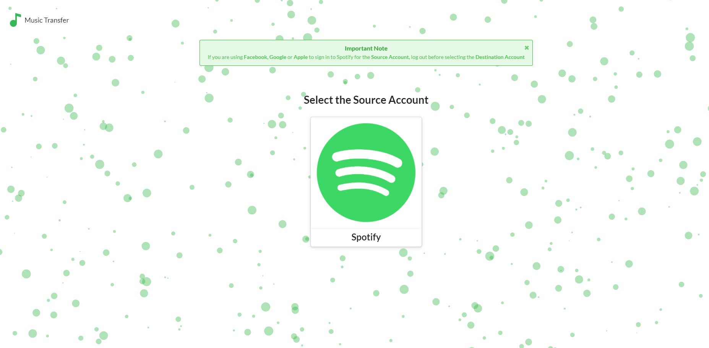
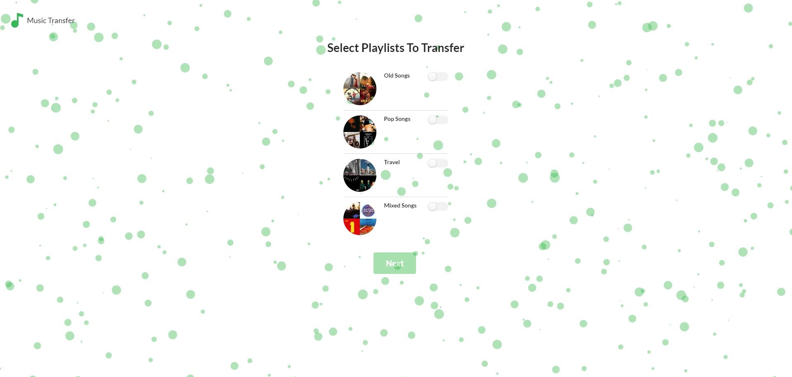
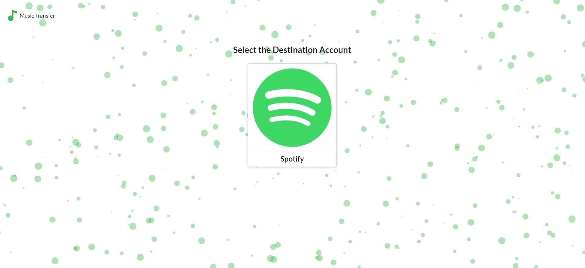
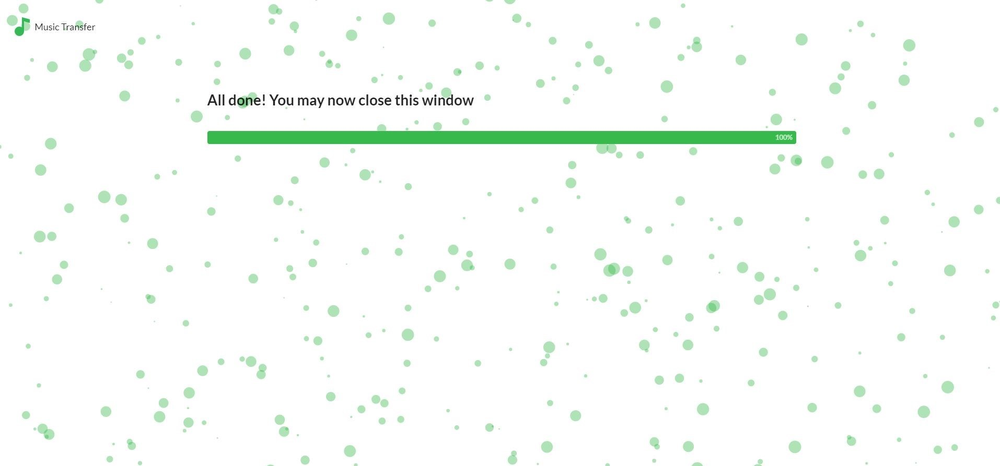

# Music Transfer

- Objective of this project is to allow users to transfer/share songs between Spotify Accounts easily

# Website Flow

### Landing Page

  
  
  ### Select Source Account Page
   
  
  ### Select Playlists Page
   
  
  
  ### Select Destination Account Page
  
  
  ### Transfer Page 
  
   
  

# Running the project locally

## Prerequisites

- In the server directory configure the .env.example file with your client_id and client_secret
- Make sure you don't have quotes around your client_id and client_secret
- Rename the .env.example file to .env

## Running the server locally

- Change the REDIRECT_URI in spotifyAPI.js file in the constants folder to "http://localhost:5433/spotify/callback/${accType}"
- Change CLIENT_BASE_URL to "http://localhost:3000"
- Open a terminal of choice
- Change directories into the project directory then into the 'server' directory
- Type 'npm run dev'

## Running the client locally

- Change BASE_URL in the strings.js file in the constants folder from "https://music-transfer-api.herokuapp.com" to "http://localhost:5433"
- Open a terminal of choice
- Change directories into the project directory then into the 'client' directory
- Type 'npm start'
