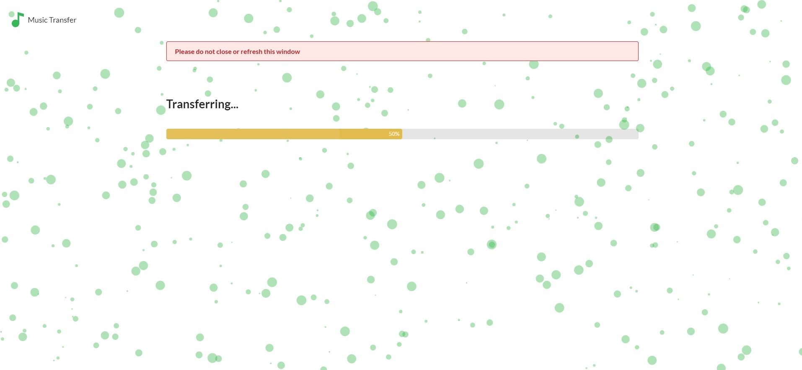
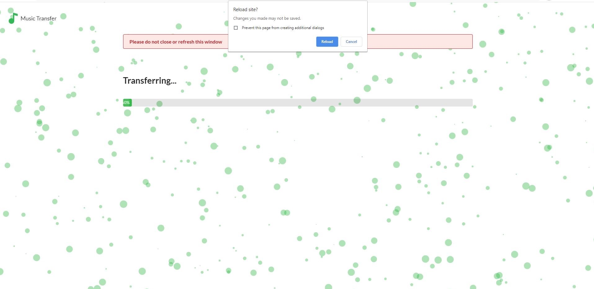

# Music Transfer

- Objective of this project is to allow users to transfer/share songs between Spotify Accounts easily

# Website Flow
  
  ### Landing Page
    
  
  ### Select Source Account Page
    
  
  ### Select Playlists Page
    
    
  
  ### Select Destination Account Page
    
  
  ### Transfer Page 
    
    
    

# Running the project locally
## Prerequisites

- In the server directory configure the .env.example file with your client_id and client_secret
- Make sure you don't have quotes around your client_id and client_secret
- Rename the .env.example file to .env

## Running the server locally

- Open a terminal of choice
- Change directories into the project directory then into the 'server' directory
- Type 'npm run dev'

## Running the client locally

- Open a terminal of choice
- Change directories into the project directory then into the 'client' directory
- Type 'npm start'
